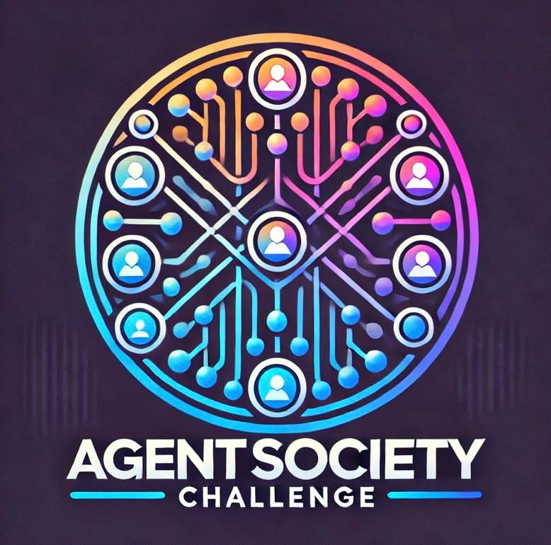

<div style="text-align: center; display: flex; align-items: center; justify-content: center; background-color: white; padding: 20px; border-radius: 30px;">
  
  <h1 style="color: black; margin: 0; font-size: 2em;">WWW'25 AgentSociety Challenge: WebSocietySimulator</h1>
</div>

# 🚀 AgentSociety Challenge
 &ensp;
[](https://www.codabench.org/competitions/4574/) &ensp;
[](https://arxiv.org/abs/2502.18754)

> **⚠️ DISCLAIMER: Educational Sandbox Template**
> This repository is a **customized educational sandbox version** designed specifically for learning CrewAI integration. It is **NOT** the official Tsinghua University AgentSociety Challenge repository. For the official upstream code, datasets, and competition guidelines, please visit the [official repository](https://github.com/tsinghua-fib-lab/AgentSocietyChallenge).

Welcome to the **WWW'25 AgentSociety Challenge**! This repository provides the tools and framework needed to participate in a competition that focuses on building **LLM Agents** for **user behavior simulation** and **recommendation systems** based on open source datasets.

Participants are tasked with developing intelligent agents that interact with a simulated environment and perform specific tasks in two competition tracks:
1. **User Behavior Simulation Track**: Agents simulate user behavior, including generating reviews and ratings.
2. **Recommendation Track**: Agents generate recommendations based on provided contextual data.

This repository includes:
- The core library `websocietysimulator` for environment simulation.
- Scripts for dataset processing and analysis.
- Example usage for creating and evaluating agents.

---

## Directory Structure

### 1. **`websocietysimulator/`**  
This is the core library containing all source code required for the competition.

- **`agents/`**: Contains base agent classes (`SimulationAgent`, `RecommendationAgent`) and their abstractions. Participants must extend these classes for their implementations.
- **`task/`**: Defines task structures for each track (`SimulationTask`, `RecommendationTask`).
- **`llm/`**: Contains base LLM client classes (`DeepseekLLM`, `OpenAILLM`).
- **`tools/`**: Includes utility tools:
  - `InteractionTool`: A utility for interacting with the Yelp dataset during simulations.
  - `EvaluationTool`: Provides comprehensive metrics for both recommendation (HR@1/3/5) and simulation tasks (RMSE, sentiment analysis).
- **`simulator.py`**: The main simulation framework, which handles task and groundtruth setting, evaluation and agent execution.

### 2. **`example/`**  
Contains usage examples of the `websocietysimulator` library. Includes sample agents and scripts to demonstrate how to load scenarios, set agents, and evaluate them.

### 3. **`data_process.py`**  
A script to process the raw Yelp dataset into the required format for use with the `websocietysimulator` library. This script ensures the dataset is cleaned and structured correctly for simulations.

---

## Quick Start

### 1. Installation

This CrewAI Sandbox version exclusively utilizes [Astral `uv`](https://github.com/astral-sh/uv) to manage all dependencies. This ensures a blazingly fast and conflict-free "out-of-the-box" experience without relying on complex Anaconda or Poetry configurations.

1. Clone the repository:
   ```bash
   git clone https://github.com/yuchieh/AgentSocietyChallenge_w_CrewAI.git
   cd AgentSocietyChallenge_w_CrewAI
   ```

2. Synchronize all dependencies via `uv`:
   ```bash
   # If you haven't installed uv yet: curl -LsSf https://astral.sh/uv/install.sh | sh
   uv sync
   ```
   *(This step strictly installs both the underlying Simulator's requirements, e.g. pandas/nltk, and the latest CrewAI suite into an isolated virtual environment.)*

3. Verify the Sandbox setup (Mock Mode):
   ```bash
   uv run python run_pipeline.py --mock
   ```
   *If the environment is set up correctly, this will simulate the CrewAI agents using a mocked LLM (zero token cost) and print a successful JSON evaluation score.*

4. Connect to Real LLM and Embedding Models:
   To unleash the genuine reasoning capabilities of the CrewAI agents, create a `.env` file in the root directory and configure your official or third-party OpenAI-compatible endpoints (e.g., NVIDIA NIM, Minimax).
   ```bash
   # .env example
   OPENAI_API_KEY=your_actual_api_key_here
   OPENAI_API_BASE=https://integrate.api.nvidia.com/v1  # Example for NVIDIA NIM
   # OPENAI_API_BASE=https://api.minimax.chat/v1        # Example for Minimax
   ```
   Once the credentials are set, run the full realistic simulation without the mock flag:
   ```bash
   uv run python run_pipeline.py
   ```
   *This mode consumes real tokens as the multi-agent system actively queries the LLM and the Vector Embedding spaces to produce accurate predictions.*

---

### `run_pipeline.py` — 情境指令速查

`run_pipeline.py` 是本 Sandbox 的主要執行腳本，支援以下情境：

| 情境 | 指令 |
|------|------|
| **環境驗證**（零成本，不呼叫 LLM） | `uv run python run_pipeline.py --mock` |
| **Smoke Test**（只跑 1 筆，確認 API 連線） | `uv run python run_pipeline.py --tasks 1` |
| **正式評分**（全部任務，sequential） | `uv run python run_pipeline.py` |
| **加速執行**（2 worker 並行） | `uv run python run_pipeline.py --threads 2` |
| **自訂逾時**（每筆最多 120 秒） | `uv run python run_pipeline.py --timeout 120` |
| **快速開發迭代**（mock + 少量任務） | `uv run python run_pipeline.py --mock --tasks 5` |
| **正式跑分 + 加速** | `uv run python run_pipeline.py --threads 2 --timeout 300` |

執行完成後會輸出 `baseline_report_<timestamp>.json`，包含評分指標與每筆任務的詳細結果。

```
CLI 參數說明：
  --mock         使用假 LLM（不消耗 Token，僅驗證流程結構）
  --tasks N      只執行前 N 筆任務
  --threads N    Worker 執行緒數（預設 1 = sequential）
  --timeout SEC  每筆任務逾時秒數（預設 300，0 = 不限）
```

---

### 2. Data Preparation

1. Download the raw dataset from the Yelp[1], Amazon[2] or Goodreads[3].
2. Run the `data_process.py` script to process the dataset:
   ```bash
   python data_process.py --input <path_to_raw_dataset> --output <path_to_processed_dataset>
   ```
- Check out the [Data Preparation Guide](./tutorials/data_preparation.md) for more information.
- **NOTICE: You Need at least 16GB RAM to process the dataset.**

---

### 3. Organize Your Data

Ensure the dataset is organized in a directory structure similar to this:

```
<your_dataset_directory>/
├── item.json
├── review.json
├── user.json
```

You can name the dataset directory whatever you prefer (e.g., `dataset/`).

---

### 4. Develop Your Agent

Create a custom agent by extending either `SimulationAgent` or `RecommendationAgent`. Refer to the examples in the `example/` directory. Here's a quick template:

```python
from yelpsimulator.agents.simulation_agent import SimulationAgent

class MySimulationAgent(SimulationAgent):
    def workflow(self):
        # The simulator will automatically set the task for your agent. You can access the task by `self.task` to get task information.
        print(self.task)

        # You can also use the `interaction_tool` to get data from the dataset.
        # For example, you can get the user information by `interaction_tool.get_user(user_id="example_user_id")`.
        # You can also get the item information by `interaction_tool.get_item(item_id="example_item_id")`.
        # You can also get the reviews by `interaction_tool.get_reviews(review_id="example_review_id")`.
        user_info = interaction_tool.get_user(user_id="example_user_id")

        # Implement your logic here
        
        # Finally, you need to return the result in the format of `stars` and `review`.
        # For recommendation track, you need to return a candidate list of items, in which the first item is the most recommended item.
        stars = 4.0
        review = "Great experience!"
        return stars, review
```

- Check out the [Tutorial](./tutorials/agent_development.md) for Agent Development.
- Baseline User Behavior Simulation Agent: [Baseline User Behavior Simulation Agent](./example/ModelingAgent_baseline.py).
- Baseline Recommendation Agent: [Baseline Recommendation Agent](./example/RecAgent_baseline.py).
---

### 5. Evaluation your agent with training data

Run the simulation using the provided `Simulator` class:

```python
from websocietysimulator import Simulator
from my_agent import MySimulationAgent

# Initialize Simulator
simulator = Simulator(data_dir="path/to/your/dataset", device="auto", cache=False)
# The cache parameter controls whether to use cache for interaction tool.
# If you want to use cache, you can set cache=True. When using cache, the simulator will only load data into memory when it is needed, which saves a lot of memory.
# If you want to use normal interaction tool, you can set cache=False. Notice that, normal interaction tool will load all data into memory at the beginning, which needs a lot of memory (20GB+).

# Load scenarios
simulator.set_task_and_groundtruth(task_dir="path/to/task_directory", groundtruth_dir="path/to/groundtruth_directory")

# Set your custom agent
simulator.set_agent(MySimulationAgent)

# Set LLM client
simulator.set_llm(DeepseekLLM(api_key="Your API Key"))

# Run evaluation
# If you don't set the number of tasks, the simulator will run all tasks.
agent_outputs = simulator.run_simulation(number_of_tasks=None, enable_threading=True, max_workers=10)

# Evaluate the agent
evaluation_results = simulator.evaluate()
```
- If you want to use your own LLMClient, you can easily implement it by inheriting the `LLMBase` class. Refer to the [Tutorial](./tutorials/agent_development.md) for more information.

---

### 6. Submit your agent
- You should register your team firstly in the competition homepage ([Homepage](https://tsinghua-fib-lab.github.io/AgentSocietyChallenge)).
- Submit your solution through the submission button at the specific track page. (the submission button is at the top right corner of the page)
  - [User Modeling Track](https://tsinghua-fib-lab.github.io/AgentSocietyChallenge/pages/behavior-track.html)
  - [Recommendation Track](https://tsinghua-fib-lab.github.io/AgentSocietyChallenge/pages/recommendation-track.html)
  - Please register your team first.
  - When you submit your agent, please carefully **SELECT the TRACK you want to submit to.**
- **The content of your submission should be a .py file containing your agent (Only one `{your_team}.py` file without evaluation code).**
- Example submissions:
  - For Track 1: [submission_1](example/trackOneSubmission_example.zip)
  - For Track 2: [submission_2](example/trackTwoSubmission_example.zip)

---

## Introduction to the `InteractionTool`

The `InteractionTool` is the core utility for interacting with the dataset. It provides an interface for querying user, item, and review data.

### Functions

- **Get User Information**:
  Retrieve user data by user ID or current scenario context.
  ```python
  user_info = interaction_tool.get_user(user_id="example_user_id")
  ```

- **Get Item Information**:
  Retrieve item data by item ID or current scenario context.
  ```python
  item_info = interaction_tool.get_item(item_id="example_item_id")
  ```

- **Get Reviews**:
  Fetch reviews related to a specific item or user, filtered by time.
  ```python
  reviews = interaction_tool.get_reviews(review_id="example_review_id")  # Fetch a specific review
  reviews = interaction_tool.get_reviews(item_id="example_item_id")  # Fetch all reviews for a specific item
  reviews = interaction_tool.get_reviews(user_id="example_user_id")  # Fetch all reviews for a specific user
  ```

## License

This project is licensed under the MIT License. See the `LICENSE` file for details.

## References

[1] Yelp Dataset: https://www.yelp.com/dataset

[2] Amazon Dataset: https://amazon-reviews-2023.github.io/

[3] Goodreads Dataset: https://sites.google.com/eng.ucsd.edu/ucsdbookgraph/home