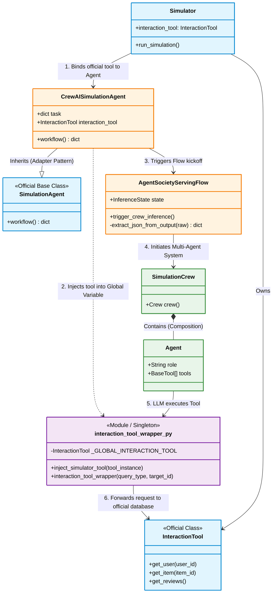

# CrewAI x AgentSociety Simulator Architecture

```mermaid
classDiagram
    %% Official Framework Layer (Simulator)
    class Simulator {
        +run_simulation()
        +interaction_tool: InteractionTool
    }
    class SimulationAgent {
        <<Official Base Class>>
        +workflow() dict
    }
    class InteractionTool {
        <<Official Class>>
        +get_user(user_id)
        +get_item(item_id)
        +get_reviews()
    }

    style Simulator fill:#e1f5fe,stroke:#0288d1,stroke-width:2px,color:#000
    style SimulationAgent fill:#e1f5fe,stroke:#0288d1,stroke-width:2px,color:#000
    style InteractionTool fill:#e1f5fe,stroke:#0288d1,stroke-width:2px,color:#000

    %% Intermediary Layer (Adapter & Flow)
    class CrewAISimulationAgent {
        +dict task
        +InteractionTool interaction_tool
        +workflow() dict
    }
    class AgentSocietyServingFlow {
        +InferenceState state
        +trigger_crew_inference()
        -extract_json_from_output(raw) dict
    }
    
    style CrewAISimulationAgent fill:#fff3e0,stroke:#f57c00,stroke-width:2px,color:#000
    style AgentSocietyServingFlow fill:#fff3e0,stroke:#f57c00,stroke-width:2px,color:#000

    %% Tool Wrapper Layer
    class interaction_tool_wrapper_py {
        <<Module / Singleton>>
        -InteractionTool _GLOBAL_INTERACTION_TOOL
        +inject_simulator_tool(tool_instance)
        +interaction_tool_wrapper(query_type, target_id)
    }

    style interaction_tool_wrapper_py fill:#f3e5f5,stroke:#7b1fa2,stroke-width:2px,color:#000

    %% Student Development Layer (CrewAI)
    class SimulationCrew {
        +Crew crew()
    }
    class Agent {
        +String role
        +BaseTool[] tools
    }

    style SimulationCrew fill:#e8f5e9,stroke:#388e3c,stroke-width:2px,color:#000
    style Agent fill:#e8f5e9,stroke:#388e3c,stroke-width:2px,color:#000

    %% Relationships and Life-Cycle Sequence
    Simulator --> CrewAISimulationAgent : 1. Binds official tool to Agent
    Simulator --> InteractionTool : Owns

    CrewAISimulationAgent --|> SimulationAgent : Inherits (Adapter Pattern)
    CrewAISimulationAgent ..> interaction_tool_wrapper_py : 2. Injects tool into Global Variable
    CrewAISimulationAgent --> AgentSocietyServingFlow : 3. Triggers Flow kickoff

    AgentSocietyServingFlow --> SimulationCrew : 4. Initiates Multi-Agent System
    SimulationCrew *-- Agent : Contains (Composition)

    Agent --> interaction_tool_wrapper_py : 5. LLM executes Tool
    interaction_tool_wrapper_py --> InteractionTool : 6. Forwards request to official database
```
